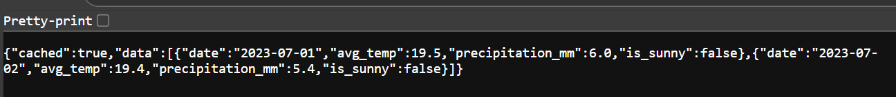
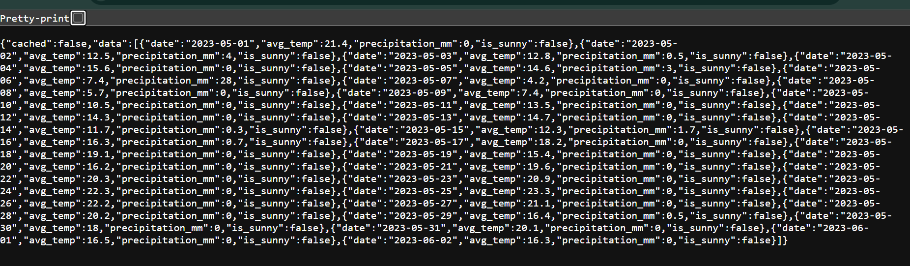
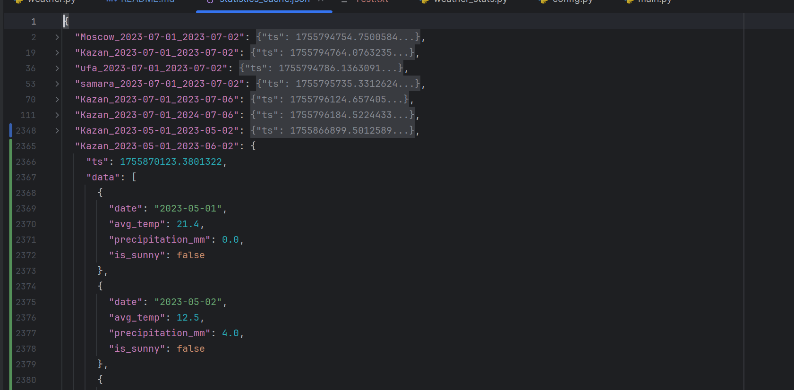
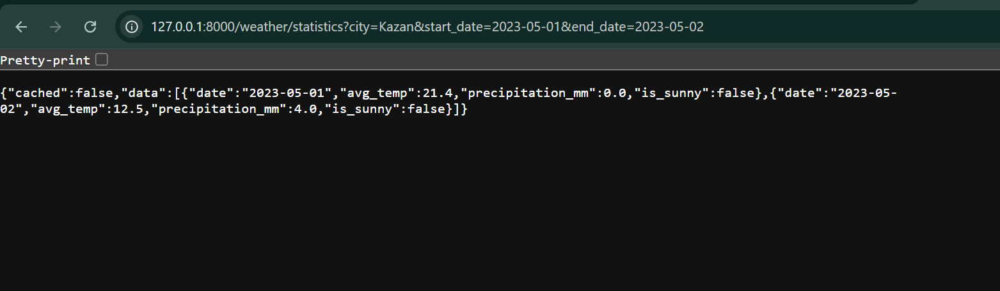

## clone the project using the command:
```commandline
git clone https://github.com/Wambong/brightminds.git
```
```commandline
cd brightminds/weatherapp
```
## run the fastapi project using cmd:
```commandline
uvicorn main:app --reload
```
## example of browser query parameters:
# for samara on the  2023-07-01 to 2023-07-02
```commandline
http://127.0.0.1:8000/weather/statistics?city=samara&start_date=2023-07-01&end_date=2023-07-02
```
## Results:


# for Kazan on the  2023-05-01 to 2023-06-02
```commandline
http://127.0.0.1:8000/weather/statistics?city=Kazan&start_date=2023-05-01&end_date=2023-06-02
```
## Results:

## Cached statistics in file statistics_cache.json:

## to run test use cmd:
```commandline
pytest -v
```
## 1) first load  cached =  false

## 2) second load  cached =  true

